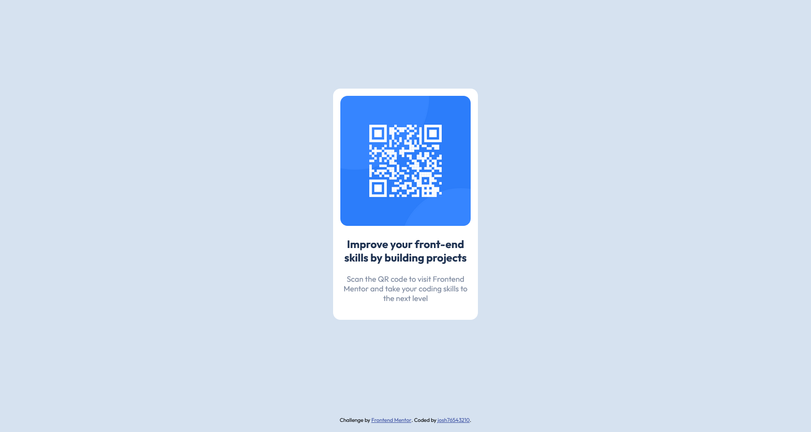

# Frontend Mentor - QR code component solution

This is a solution to the [QR code component challenge on Frontend Mentor](https://www.frontendmentor.io/challenges/qr-code-component-iux_sIO_H). Frontend Mentor challenges help you improve your coding skills by building realistic projects.

## Table of contents

- [Overview](#overview)
  - [Screenshot](#screenshot)
  - [Links](#links)
- [My process](#my-process)
  - [Built with](#built-with)
  - [What I learned](#what-i-learned)
  - [Useful resources](#useful-resources)
- [Author](#author)

## Overview

### Screenshot



### Links

- Solution URL: [https://www.frontendmentor.io/solutions/qrcodecomponent-Dop_AmrZrw](https://www.frontendmentor.io/solutions/qrcodecomponent-Dop_AmrZrw)
- Live Site URL: [https://helpful-bonbon-f1761c.netlify.app/](https://helpful-bonbon-f1761c.netlify.app/)

## My process

### Built with

- HTML5
- CSS3

### What I learned

- Adding an html entity for better spacing in the attribution.

```html
Challenge by&nbsp;
<a href="https://www.frontendmentor.io?ref=challenge" target="_blank">
  Frontend Mentor </a
>. Coded by&nbsp;
<a href="https://www.frontendmentor.io/profile/josh76543210" target="_blank"
  >josh76543210</a
>.
```

- Using CSS and Flexbox to center elements horizontally and vertically.
- Using CSS and calc() to account for attribution.

```css
.container {
  height: calc(100vh - 50px);

  display: flex;
  align-items: center;
  justify-content: center;
}
```

### Useful resources

- [w3schools - HTML Entities](https://www.w3schools.com/html/html_entities.asp) - This helped me find the html entity for a non-breaking space.

## Author

- Frontend Mentor - [@josh76543210](https://www.frontendmentor.io/profile/josh76543210)
- Twitter - [@josh76543210](https://www.twitter.com/josh76543210)
